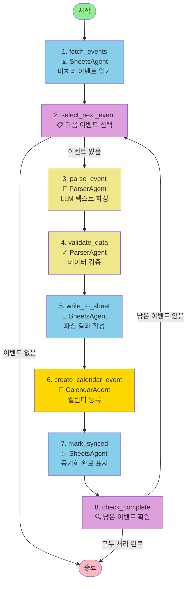
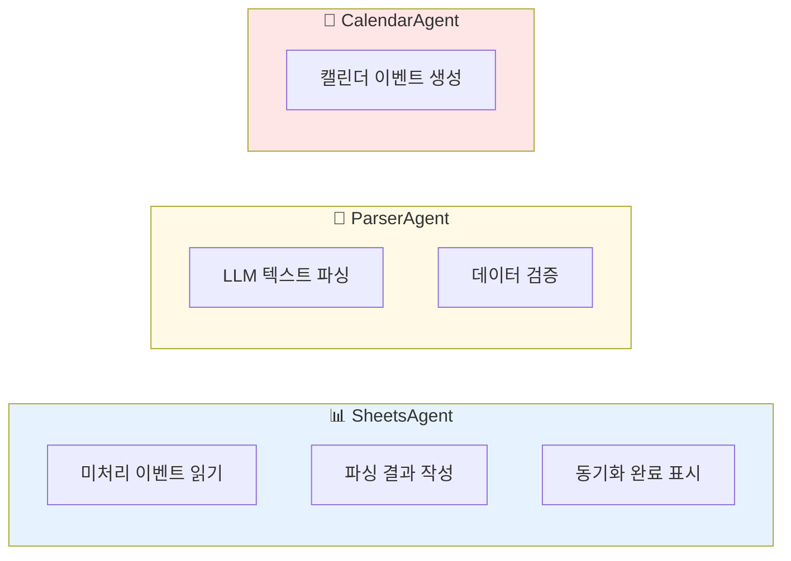
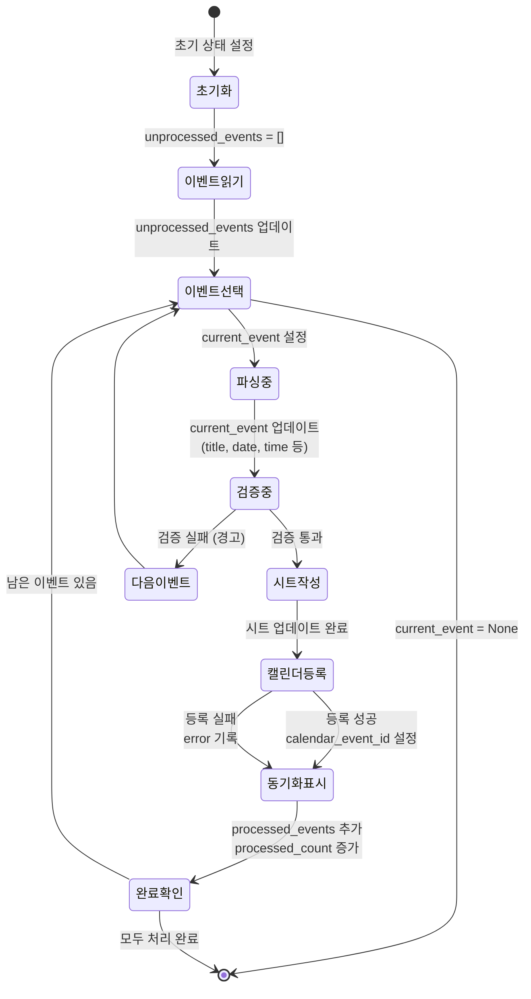
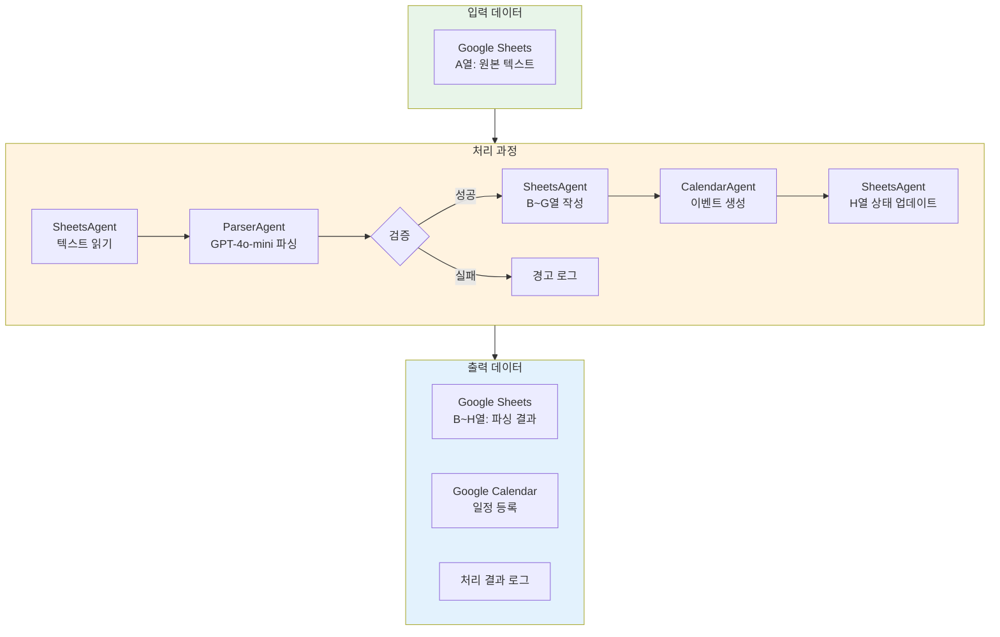
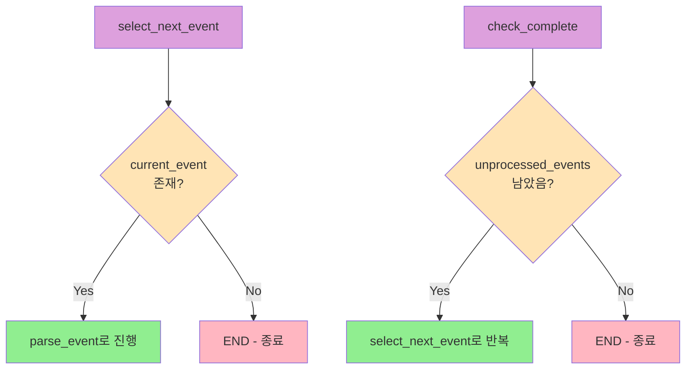
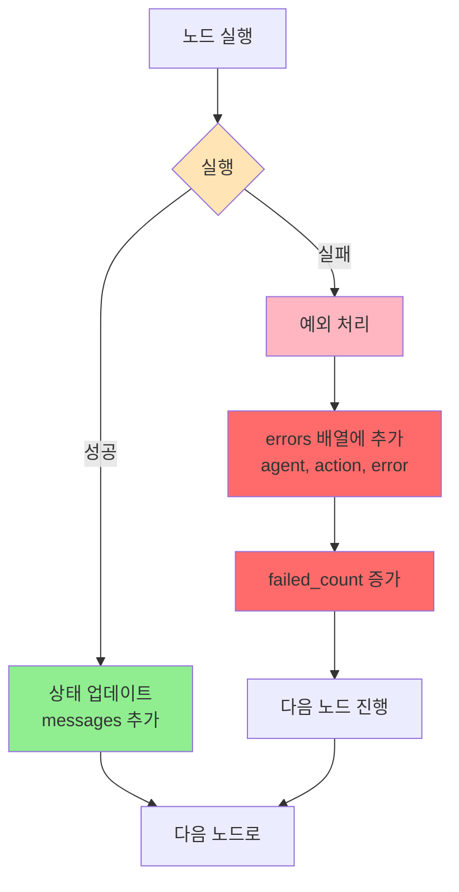
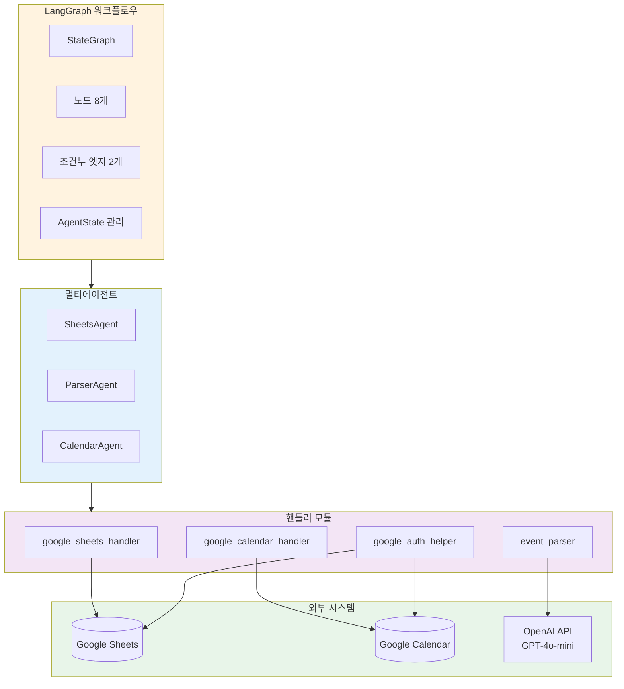
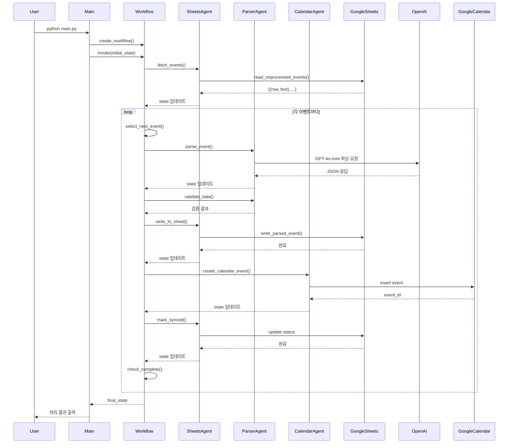

# 🔄 LangGraph 워크플로우 다이어그램

## 전체 워크플로우 구조

## 에이전트별 역할

## 상태 흐름도

## 데이터 플로우

## 조건부 라우팅 상세

## 에러 처리 흐름

## 전체 시스템 아키텍처

## 실행 시퀀스 다이어그램

---

## 📊 통계

- **총 노드 수**: 8개
- **에이전트 수**: 3개 (SheetsAgent, ParserAgent, CalendarAgent)
- **조건부 라우팅**: 2개 (route_after_selection, should_continue)
- **외부 API**: 3개 (Google Sheets, Google Calendar, OpenAI)
- **처리 단계**: 이벤트당 8단계

---

## 🔗 관련 파일

- **워크플로우 정의**: [workflow.py](workflow.py)
- **상태 정의**: [agents/state.py](agents/state.py)
- **에이전트 구현**: [agents/](agents/) 폴더
- **메인 실행**: [main.py](main.py)
